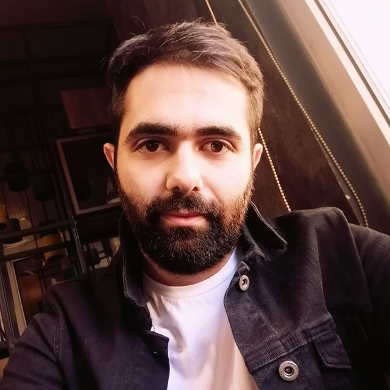

<!-- ---
template: home.html
title: Java Mastery Journey
ᴴₒᴴₒᴴₒ: false
--- -->

# Embarking on the Java Mastery Journey

Alireza and Sadegh, driven by their passion for Java programming, have set out on a journey to elevate their seniority levels in Java development. This quest is fueled by their shared commitment to honing their skills and becoming experts in the Java ecosystem.

## About Our Journey

As part of our commitment to continuous learning, we are excited to explore the vast landscape of Java development. Our goal is to not only understand the core concepts of Java but also to delve into advanced topics, design patterns, and best practices. We believe that by enhancing our expertise, we can contribute meaningfully to the world of Java development.

## Why Java?

Java, being a versatile and widely-used programming language, offers numerous opportunities for growth and innovation. From building scalable enterprise applications to crafting efficient algorithms, Java provides a solid foundation for various domains within the software development landscape.

## Join Us on Our Learning Adventure

Feel free to join us on this exciting learning adventure as we document our progress, share insights, and contribute to the vibrant Java community. Together, let's strive for excellence in Java development and elevate our seniority levels in the ever-evolving world of programming.

Happy coding!
