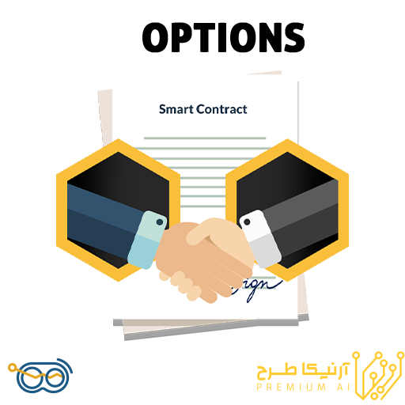

# Option Docs
### Django Setting Configuration
- Go To core/Settings.py and change the database configs
- Change the rest/config/database_config.yml based on your database configuration
- install requirments.txt with below command
```
pip install -r requirments.txt
```

- Migration:
```
python3 manage.py migrate
```
- Running

{ width="400" }
### What are Options in Finance?

Options are financial contracts that allow the buyer a right, but not an obligation – like in the case of futures or stocks, to buy or sell an asset on a specific date at a particular price called the strike price, which is predetermined at the date when the option is being purchased or sold.


### purpose of the option in pluto
There are many trading strategies in option markets,these strategies are for taking profit and risk management.The project's purpose is to find best option's contracts that are suitable for that specific strategy.


## Market View

The data is taken from the Tsetmc web service api and insert into database,database's rows must be update every 'x' second or minute so we use the scheduler to update them in specific period of time and use Django REST framework toolkit for building option's web apis.


