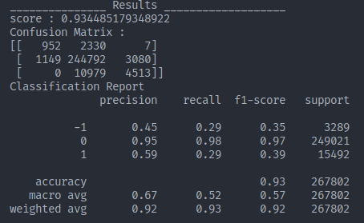

# version 3

## Feature set

```python

spread = (SellPrice1 - BuyPrice1) / meanRange
validBuyRowNo = sum(BP1v, BP2v, BP3v, BP4v, BP5v)
validSellRowNo = sum(SP1v, SP2v, SP3v, SP4v, SP5v)
distanceB1&B2 =  (BuyPrice1 - BuyPrice2) / meanRange
distanceB2&B3 =  (BuyPrice2 - BuyPrice3) / meanRange
distanceB3&B4 =  (BuyPrice3 - BuyPrice4) / meanRange
distanceB4&B5 =  (BuyPrice4 - BuyPrice5) / meanRange
distanceS1&S2 =  abs((SellPrice1 - SellPrice2) / meanRange)
distanceS2&S3 =  abs((SellPrice2 - SellPrice3) / meanRange)
distanceS3&S4 =  abs((SellPrice3 - SellPrice4) / meanRange)
distanceS4&S5 =  abs((SellPrice4 - SellPrice5) / meanRange)

proportionSumOfSellAndSumOfBuyPrice =  ((SellPrice1+SellPrice2+SellPrice3+SellPrice4+SellPrice5)/validSellRowNo)/((BuyPrice1+BuyPrice2+BuyPrice3+BuyPrice4+BuyPrice5)/validBuyRowNo)
proportionSumOfSellAndSumOfBuyVolumes =  ((SellVolume1+SellVolume2+SellVolume3+SellVolume4+SellVolume5)/validSellRowNo)/((BuyVolume1+BuyVolume2+BuyVolume3+BuyVolume4+BuyVolume5)/validBuyRowNo)
proportionSumOfSellAndSumOfBuyOrderCount =  ((SellOrderCount1+SellOrderCount2+SellOrderCount3+SellOrderCount4+SellOrderCount5)/validSellRowNo)/((BuyOrderCount1+BuyOrderCount2+BuyOrderCount3+BuyOrderCount4+BuyOrderCount5)/row.validBuyRowNo)
### used for other features and then dropped
sumOfBuyVolumes = (BuyVolume1 + BuyVolume2 + BuyVolume3 + BuyVolume4 + BuyVolume5)
sumOfSellVolumes = (SellVolume1 + SellVolume2 + SellVolume3 + SellVolume4 + SellVolume5)
sumOfBuyOrderCounts = (BuyOrderCount1 + BuyOrderCount2 + BuyOrderCount3 + BuyOrderCount4 + BuyOrderCount5)
sumOfSellOrderCount = (SellOrderCount1 + SellOrderCount2 + SellOrderCount3 + SellOrderCount4 + SellOrderCount5)
###
maxOfBuyVolumes = max(BuyVolume1, BuyVolume2, BuyVolume3, BuyVolume4, BuyVolume5)/(sumOfBuyVolumes/validBuyRowNo)
maxOfSellVolumes = max(SellVolume1, SellVolume2, SellVolume3, SellVolume4, SellVolume5)/(sumOfSellVolumes/validSellRowNo)

maxOfBuyVolumePerCount = __calculate_maximum_proportion(BuyVolume1, BuyOrderCount1, BuyVolume2, BuyOrderCount2, BuyVolume3, BuyOrderCount3, BuyVolume4, BuyOrderCount4, BuyVolume5, BuyOrderCount5)/(sumOfBuyVolumes/validBuyRowNo), axis=1)
maxOfSellVolumePerCount = __calculate_maximum_proportion(SellVolume1, SellOrderCount1, SellVolume2, SellOrderCount2, SellVolume3, SellOrderCount3, SellVolume4, SellOrderCount4, SellVolume5, SellOrderCount5)/(sumOfSellVolumes/validSellRowNo), axis=1)
BuyPrice1Normal = __normalized_amount(BuyPrice1 - minThreshold, maxThreshold - minThreshold)
BuyPrice2Normal = __normalized_amount(BuyPrice2 - minThreshold, maxThreshold - minThreshold)
BuyPrice3Normal = __normalized_amount(BuyPrice3 - minThreshold, maxThreshold - minThreshold)                                                                                                                                                                                                                                               
BuyPrice4Normal = __normalized_amount(BuyPrice4 - minThreshold, maxThreshold - minThreshold)                                                                                                                       
BuyPrice5Normal = __normalized_amount(BuyPrice5 - minThreshold, maxThreshold - minThreshold)
SellPrice1Normal = __normalized_amount(SellPrice1 - minThreshold, maxThreshold - minThreshold)
SellPrice2Normal = __normalized_amount(SellPrice2 - minThreshold, maxThreshold - minThreshold)
SellPrice3Normal = __normalized_amount(SellPrice3 - minThreshold, maxThreshold - minThreshold)                                                                                                                                                                                                                                               
SellPrice4Normal = __normalized_amount(SellPrice4 - minThreshold, maxThreshold - minThreshold)                                                                                                                       
SellPrice5Normal = __normalized_amount(SellPrice5 - minThreshold, maxThreshold - minThreshold)
BuyOrderCount1Normal = __normalized_amount(BuyOrderCount1, sumOfBuyOrderCounts/ validBuyRowNo)
BuyOrderCount2Normal = __normalized_amount(BuyOrderCount2, sumOfBuyOrderCounts/ validBuyRowNo)
BuyOrderCount3Normal = __normalized_amount(BuyOrderCount3, sumOfBuyOrderCounts/ validBuyRowNo)                                                                                                                                                                                                                                               
BuyOrderCount4Normal = __normalized_amount(BuyOrderCount4, sumOfBuyOrderCounts/ validBuyRowNo)                                                                                                                       
BuyOrderCount5Normal = __normalized_amount(BuyOrderCount5, sumOfBuyOrderCounts/ validBuyRowNo)
SellOrderCount1Normal = __normalized_amount(SellOrderCount1, sumOfSellOrderCount/ validSellRowNo)

SellOrderCount2Normal = __normalized_amount(SellOrderCount2, sumOfSellOrderCount/ validSellRowNo)
SellOrderCount3Normal = __normalized_amount(SellOrderCount3, sumOfSellOrderCount/ validSellRowNo)                                                                                                                                                                                                                                               
SellOrderCount4Normal = __normalized_amount(SellOrderCount4, sumOfSellOrderCount/ validSellRowNo)                                                                                                                       
SellOrderCount5Normal = __normalized_amount(SellOrderCount5, sumOfSellOrderCount/ validSellRowNo)
BuyVolume1Normal = __normalized_amount(BuyVolume1, sumOfBuyVolumes/validBuyRowNo)
BuyVolume2Normal = __normalized_amount(BuyVolume2, sumOfBuyVolumes/validBuyRowNo)
BuyVolume3Normal = __normalized_amount(BuyVolume3, sumOfBuyVolumes/validBuyRowNo)                                                                                                                                                                                                                                               
BuyVolume4Normal = __normalized_amount(BuyVolume4, sumOfBuyVolumes/validBuyRowNo)                                                                                                                       
BuyVolume5Normal = __normalized_amount(BuyVolume5, sumOfBuyVolumes/validBuyRowNo)
SellVolume1Normal = __normalized_amount(SellVolume1, sumOfSellVolumes/validSellRowNo)
SellVolume2Normal = __normalized_amount(SellVolume2, sumOfSellVolumes/validSellRowNo)
SellVolume3Normal = __normalized_amount(SellVolume3, sumOfSellVolumes/validSellRowNo)                                                                                                                                                                                                                                               
SellVolume4Normal = __normalized_amount(SellVolume4, sumOfSellVolumes/validSellRowNo)                                                                                                                       
SellVolume5Normal = __normalized_amount(SellVolume5, sumOfSellVolumes/validSellRowNo)

```
## Model
## Predictions and Results
- مجموعه داده آموزش (جمع آوری شده از داده های تاریخ 20210712 الی 20221122)
  
| فراوانی در مجموعه داده | برچسب |
|------------------------|-------|
| 447229                 | 1     |
| 5686263                | 0     |
| 478232                 | -1    |


- مجموعه داده آزمون (جمع آوری شده از داده های تاریخ 20221123 الی 20221211)
  
| فراوانی در مجموعه داده | برچسب |
|------------------------|-------|
| 15492                 | 1     |
| 249021                | 0     |
| 3289                 | -1    |

- نتایج اجرا مدل آموزش دیده با تمامی ویژگی ها بر روی مجموعه داده آزمون:



- بررسی اهمیت ویژگی های مورد استفاده در مدل:


