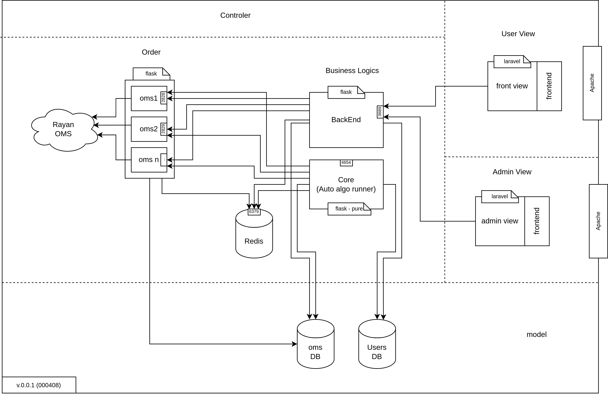

# Setup
## Components

| **Component**      | **Product v\.**    | **Last v\.** |**Machine**| **Repo**                                                          |
|--------------------|--------------------|--------------|-----------|-------------------------------------------------------------------|
| **core**           | 2\.7               | 2\.8         |Controller | https://repo\.arnika\.ai/m\_mahmoudi/Spout\_Core                  |
| **backend**        | 2\.6               | 3\.0         |Controller | https://repo\.arnika\.ai/m\_mahmoudi/Spout\_FrontOffice\_Core     |
| **oms_driver**     | c2ff71a3f1         | \-           |Controller | https://repo\.arnika\.ai/m\_mahmoudi/RayanOMS                     |
| **user_frontend**  | 0178038e83         | \-           |View User  | https://repo\.arnika\.ai/ameer/spout\-dashboard                   |
| **user_view**      | ea724acd87         | \-           |View User  | https://repo\.arnika\.ai/a\_sepehr/Spout\-Front/src/branch/NewUI  |
| **admin_frontend** | 471079da75         | \-           |View Admin | https://repo\.arnika\.ai/ameer/spout\-dashboard                   |

## Component Diagram

<!-- - ادمین فرانت توی ویو ینی توی لاراوله
- فرانت یوزر 

- یه سری فایل اینوایرمنت هست که باید طبق فایل های استیج باشه
- ست شدن کوکی -->

## Dependency Graph

## SetUp

1. [Model Machine](./00-ModelMachine)
2. [Controller Machine](./01-ControllerMachine)
3. [UserViewMachine](./02-UserViewMachine)
3. [AdminViewMachine](./03-AdminViewMachine)

